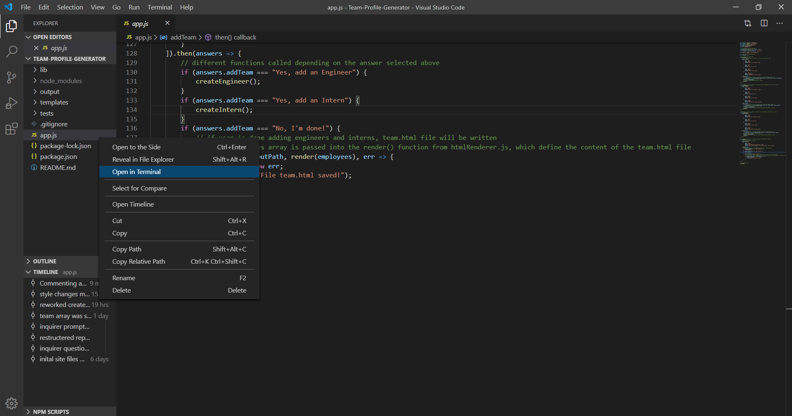
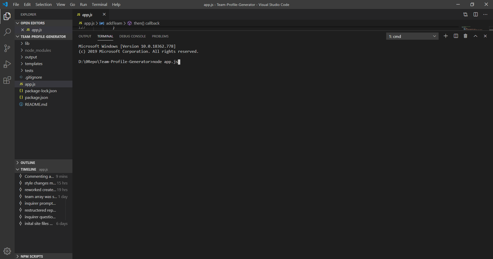
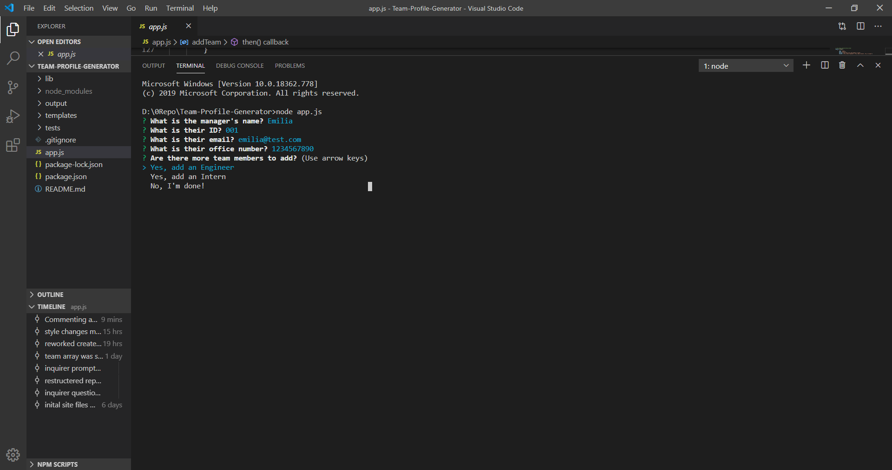
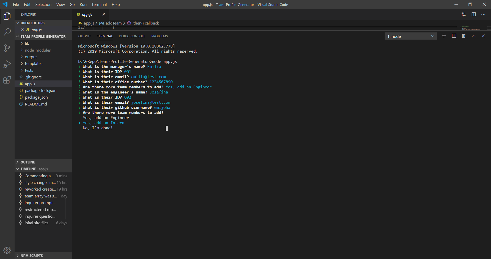
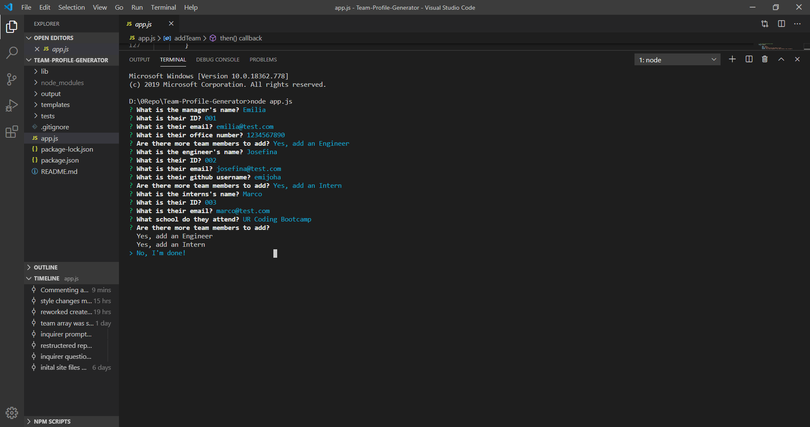
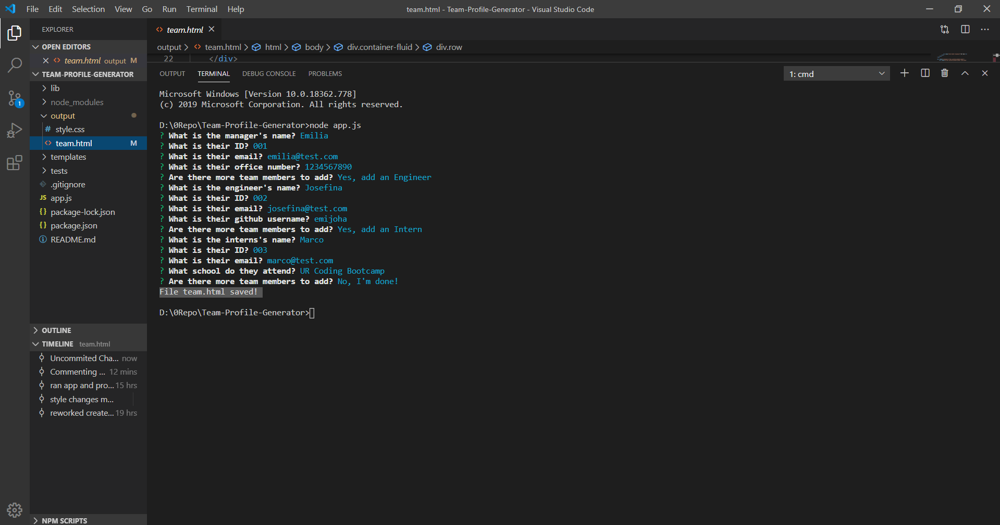
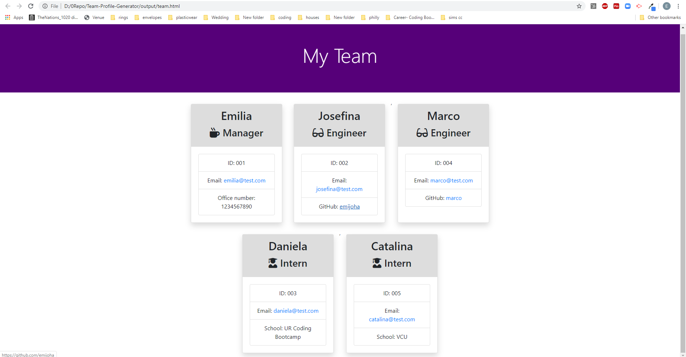
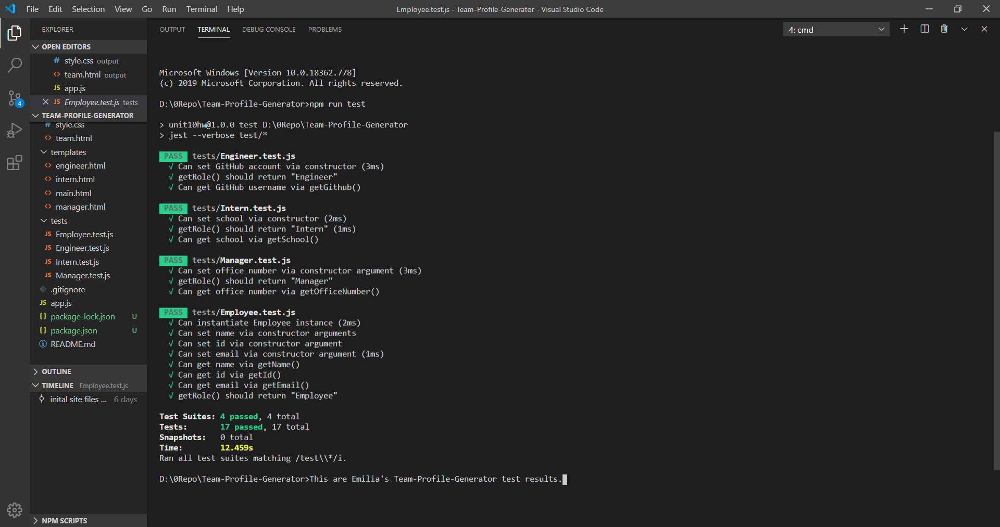

# Team Profile Generator

## Description

A Node CLI application that takes in information about employees in a software engineering team and generates an HTML webpage that displays summaries for each person. 

## Table of Contents

* [Installation](#installation)
* [Usage](#usage)
* [License](#license)
* [Contributing](#contributing)
* [Tests](#tests)
* [Questions](#questions)

## Installation

1. Clone the Team-Profile-Generator repo to a local repo. 
2. Open that local repo.
3. Open the terminal in the main directory and run `npm install`
4. In the terminal, run `node app.js` to open the CLI app.

## Usage

When developing a new project with a team, use this CLI application to automatically generate a well-styled webpage containing each person's information.

1. In the main directory, open the terminal.

    

2. Run `node app.js`

    

3. The user will first be prompted to enter the name, id (employee id or other unique id), and email contact for the team manager, as well as their office phone number.

4. When finished, the user will be asked which new member they would like to add to the team (An engineer, intern, or none).

    

5. If the 'engineer' choice is selected, the user will be prompted to enter the name, id, and email contact for that the engineer, as well as their github username.

     

6. If the 'intern' choice is selected, the user will be prompted to enter the name, id, and email contact for that intern, as well as the school they attend.

    

7. When the user is done adding all engineers and interns to the team, they can select the 'No, I'm done!' choice to exit out of the application.

8. A message appears confirming the team.html webpage has been made and saved to the 'output' folder. 

    

9. If exporting this file to another repo for deployment or other reason, make sure to also export the style.css file in the 'output' folder. This will insure the webpage retains all its styling. Below is an example of the generated webpage.

    

## License

MIT License
Copyright 2020 Emilia Josefina Hartline.

## Contributing

Pull requests are welcome. For major changes, please open an issue first to discuss what you would like to change. Please make sure to update tests as appropriate.

## Tests

You will find tests for this project in the 'test' folder of the repo. These tests check whether the Employee class and Manager, Engineer, and Intern subclasses function as expected. To run these tests, open the terminal in the main directory and run `npm run test`.  It will take a few seconds and then show results of the tests. Additional tests are currently in development to test other functionalities.

## Questions

Feel free to reach out to me with any questions or comments!

Email Emilia Josefina Hartline at ejhartline@gmail.com 
